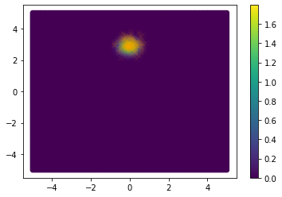

## Normalizing Flows

We used for this project 2 different datasets:

1. Shifted Guassian
2. 2 Moons

and 2 transformations: 

1. Affine Transformation

An affine tranformation scales each dimension independently and shifts the inputs by a constant offset. The tranformation is defined as follows:

where parameters a from R^D b from R^D. 
We apply 'exp' elementwise to 'a' to obtain positive scales for each dimension. 

2. Radial Transformation

A radial flow is a simple but expressive transformation. It has been introduced in this paper(https://arxiv.org/pdf/1505.05770.pdf) by Rezende and Mohamed. The transformation is defined as:

**Results:** 

Dataset: Shifted Guassian

Dataset: 2 Moons

**PyTorch** was used for the development of the model.
